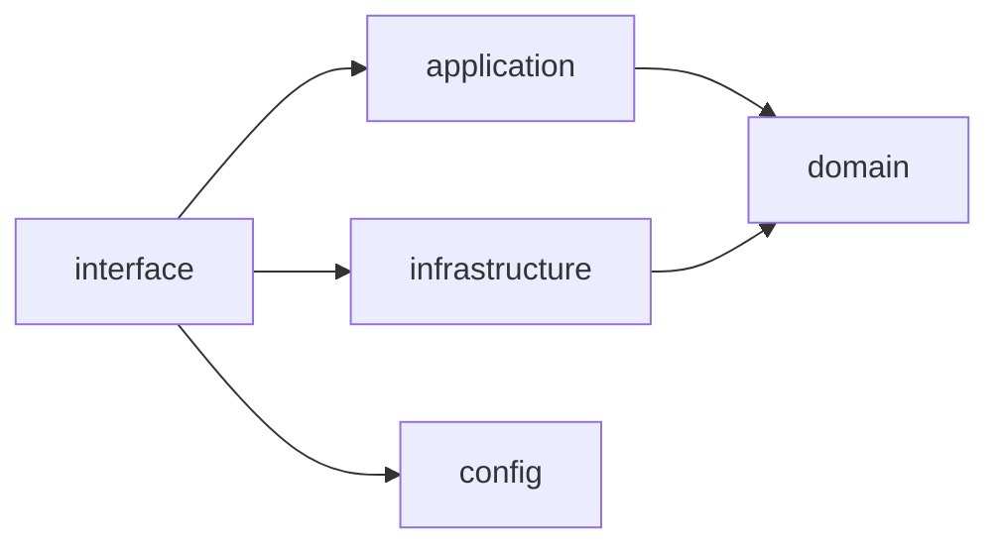
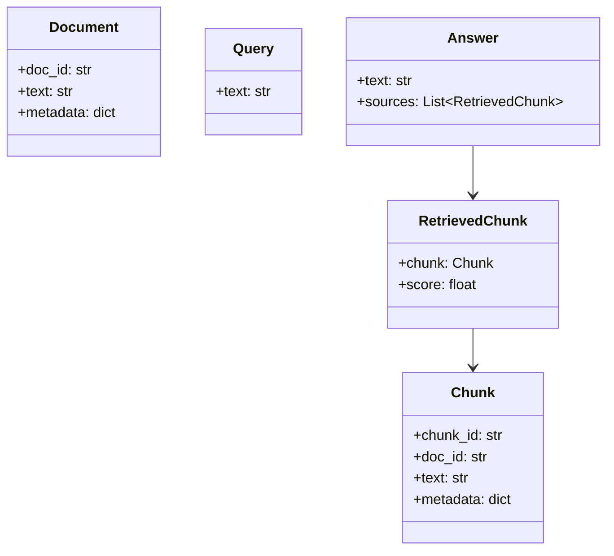
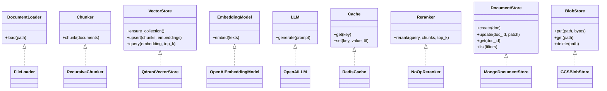
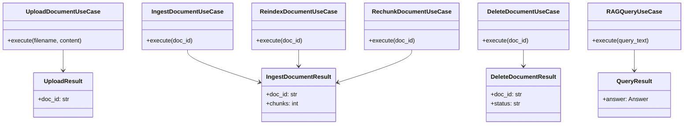
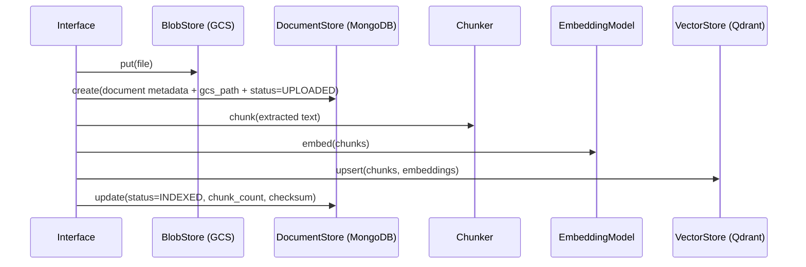
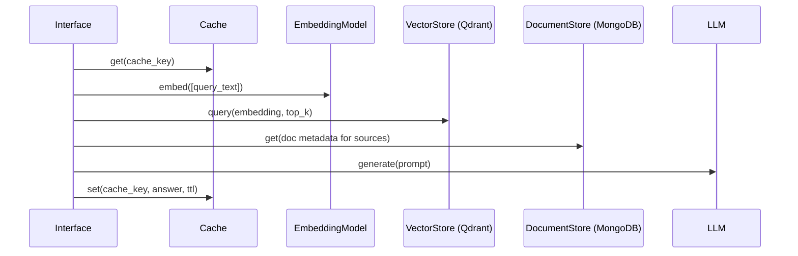
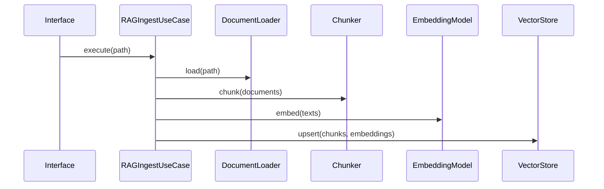
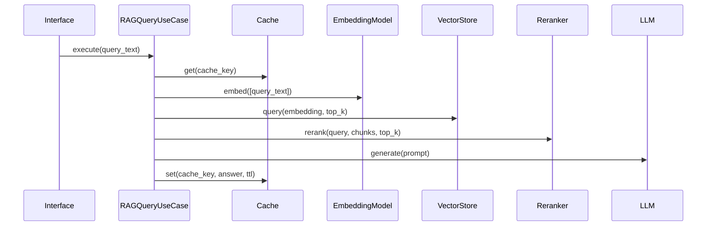

# Architecture (DDD RAG)

## Dependency Flow (Clean Architecture)

## Layer Overview

- Domain: business objects (entities/value objects) + ports (interfaces).
- Application: use cases + DTOs that package results.
- Infrastructure: adapters implementing ports (IO, models, stores).
- Interface: API/CLI composition root; maps IO to use cases.
- Config: settings for adapters and use case defaults.

## Domain Model (Core)

Notes:
- `Document` and `Chunk` represent persisted knowledge.
- `Query` and `Answer` are value objects for the interaction.
- `RetrievedChunk` is a projection of retrieval results (chunk + score).

## Ports and Adapters

## Application Layer

## Interfaces

- API (FastAPI): `QueryRequest`, `QueryResponse`.
- CLI (Typer): `upload`, `ingest-doc`, `query`, `reindex-doc`, `rechunk-doc`, `delete-doc`.
- Both are composition roots wiring adapters + use cases.

## Storage Model (Production)

- MongoDB is the source of truth for document metadata and extracted text.
- Google Cloud Storage (GCS) stores raw files (PDFs, etc.).
- Qdrant stores embeddings for retrieval.

Example MongoDB collections:
- `documents`: one doc per source file, with status and metadata.
- `chunks`: persisted chunks for fast reindexing.
- `ingest_jobs`: ingestion status and errors.

Example document fields (`documents`):
- `_id`, `title`, `source_uri`, `gcs_path`, `status`
- `text`, `metadata`, `created_at`, `updated_at`
- `version`, `checksum`

## Production Ingest Flow (MongoDB + GCS)

## Production Query Flow (MongoDB + GCS)

## Key Flows

### Ingest Flow

### Query Flow

